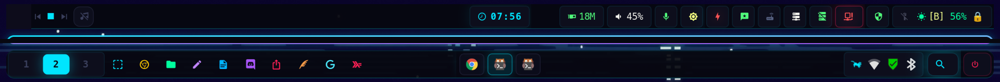

<div align="right">
  <a href="README.md">🇺🇸 English</a> &nbsp;|&nbsp;
  <a href="README.pt-BR.md">🇧🇷 Português</a>
</div>

# Waybar Cyberpunk Tokyo

Configuração de Waybar com estética cyberpunk dark (paleta Tokyo Night / Dracula), com um cluster de monitoramento de segurança, monitores de hardware com tooltips estilizados e layout de barra dupla para Hyprland.

## Preview



> **Barra superior:** VRAM · Áudio · Microfone · Brilho · Perfil de Desempenho · Bateria · Cluster de segurança  
> **Barra inferior:** Workspaces · Atalhos de apps · Taskbar · Tray

## Funcionalidades

### Hardware
| Módulo | Descrição |
|---|---|
| `custom/vram` | Uso de VRAM da GPU NVIDIA, temperatura e % GPU — via `nvidia-smi` |
| `custom/battery` | Carga %, saúde, consumo de energia, ciclos — detecta bateria automaticamente |
| `custom/audio` | Volume com barra visual, scroll para ajustar, clique do meio para mutar |
| `custom/mic` | Estado mudo do microfone — clique para alternar |
| `custom/powerprofile` | Perfil de desempenho ativo + todos os perfis disponíveis |
| `backlight` | Brilho do display |

### Segurança
| Módulo | Descrição |
|---|---|
| `custom/connections` | Conexões TCP externas ativas |
| `custom/firewall` | Estado do nftables + gerenciador de regras pentest (`fw-ops`) |
| `custom/ports` | Portas abertas (externas vs loopback, portas de risco destacadas) |
| `custom/antivirus` | Status do daemon ClamAV + log de ameaças |
| `custom/wifi-pentest` | Estado da interface Wi-Fi, detecção de VPN, modo monitor |
| `custom/rogue-ap` | Monitor de sessão Rogue AP (requer [rogue-ap](https://github.com/)) |

### Player
Controles MPD com capa do álbum, informações da faixa e integração com ncmpcpp.

## Requisitos

### Base
- [Waybar](https://github.com/Alexays/Waybar) ≥ 0.10
- [Hyprland](https://hyprland.org/) (ou adapte os módulos para seu WM)
- Python 3.8+
- Uma [Nerd Font](https://www.nerdfonts.com/) — MesloLGS ou JetBrains Mono recomendada

### Por módulo
| Módulo | Dependência |
|---|---|
| VRAM | `nvidia-smi` (drivers NVIDIA) |
| Áudio / Mic | `pipewire` + `wireplumber` (`wpctl`) |
| Perfil de Desempenho | `power-profiles-daemon` |
| Brilho | `brightnessctl` ou `light` |
| Conexões / Portas | `iproute2` (`ss`) |
| Firewall | `nftables` |
| Antivírus | `clamav` (clamd + freshclam) |
| Wi-Fi | `iw`, `iwconfig`, `macchanger` |
| Player | `mpd`, `mpc`, `ncmpcpp`, `ffmpeg` |
| Interface de áudio | `pavucontrol` |
| Lançador de apps | `wofi` |
| Menu de energia | `nwg-bar` |

### Ubuntu / Debian
```bash
sudo apt install waybar python3 pipewire wireplumber \
    power-profiles-daemon iproute2 nftables clamav \
    iw macchanger mpc ncmpcpp ffmpeg pavucontrol wofi
```

### Arch / CachyOS / Manjaro
```bash
sudo pacman -S waybar python pipewire wireplumber \
    power-profiles-daemon iproute2 nftables clamav \
    iw macchanger mpc ncmpcpp ffmpeg pavucontrol wofi
```

## Instalação

```bash
git clone https://github.com/degurechaffcode2/waybar-cyberpunk.git
cd waybar-cyberpunk
chmod +x install.sh
./install.sh
```

O script faz backup da configuração existente e copia todos os arquivos para `~/.config/waybar/`.

## Configuração

### Fuso Horário
Edite `config.jsonc` e altere o fuso horário do relógio:
```jsonc
"clock": {
  "timezone": "America/Sao_Paulo",  // altere para o seu fuso
  ...
}
```
Lista completa de fusos: [tz database](https://en.wikipedia.org/wiki/List_of_tz_database_time_zones)

### Interface Wi-Fi
O randomizador de MAC em `custom/wifi-pentest` usa `wlan0` por padrão.  
Verifique o nome da sua interface com `ip link show` e atualize o comando `on-click-right` em `config.jsonc`.

### Diretório de Música (MPD)
`mpd-cover.sh` usa `~/Music` por padrão. Sobrescreva com a variável de ambiente:
```bash
export MPD_MUSIC_DIR="/caminho/para/sua/musica"
```
Ou defina permanentemente no seu perfil de shell (`~/.bashrc`, `~/.zshrc`).

### Sem GPU NVIDIA
Remova `custom/vram` de `modules-right` em `config.jsonc`.

### Sem necessidade do cluster de segurança
Os módulos `connections`, `firewall`, `ports`, `antivirus`, `wifi-pentest` e `rogue-ap` podem ser removidos de `modules-right` se não forem necessários.

## Estilo dos Tooltips

Todos os módulos customizados compartilham o mesmo design de tooltip:
- **Fonte:** JetBrains Mono / Fira Code (fallback monospace)
- **Paleta:** Dracula — cabeçalhos roxos, rótulos ciano, estados coloridos
- **Layout:** linhas em árvore `├─ / └─` com valores codificados por cor

## Licença

MIT
